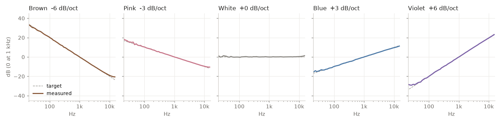

# A's Noise Generator

A PWA that generates colored noise accurately, completely offline, on your phone. Made entirely with Claude Code. Hosted on [Val Town](https://a-noise-generator.val.run).

**[Open the app](https://a-noise-generator.val.run)**, then Add to Home Screen. After the first visit it works with no connection.

## Why

Most noise apps and videos are not accurate. Many are recordings squeezed through lossy codecs (MP3, AAC, streaming video), which are designed to throw detail away, and broadband noise is the hardest thing for them to encode. Others use off-the-shelf formulas that drift from the definition, or loop a short clip.

This app synthesizes the noise live, sample by sample, from the published math. Nothing is recorded, compressed, or looped.

## Accuracy

Measured from the app's real audio output in Chromium, running offline, with the shaping controls off:



| Color | Target | Measured | Worst octave (63 Hz to 4 kHz) |
|---|---|---|---|
| Brown | -6 dB/oct | -5.99 | off by 0.24 dB |
| Pink | -3 dB/oct | -3.00 | off by 0.16 dB |
| White | 0 dB/oct | +0.03 | off by 0.18 dB |
| Blue | +3 dB/oct | +3.00 | off by 0.10 dB |
| Violet | +6 dB/oct | +5.96 | off by 0.15 dB |

The small wobble is the randomness of a 14-second noise sample. Reproduce it with `node tools/measure.mjs`.

## The research behind it

Noise colors are defined by **slope** (how fast energy changes as pitch rises), not by particular frequencies.

| Color | Definition | How the app makes it |
|---|---|---|
| Brown | Falls 6.02 dB per octave (1/f²), excluding DC | Leaky integrator of white noise: `br = 0.998 * br + 0.022 * w` |
| Pink | Falls 3.01 dB per octave (1/f) | Paul Kellet's refined filter |
| White | Flat | Uniform random samples |
| Blue | Rises 3.01 dB per octave (f) | Pink, differentiated |
| Violet | Rises 6.02 dB per octave (f²) | White, differentiated |

Definitions: [Wikipedia, Colors of noise](https://en.wikipedia.org/wiki/Colors_of_noise).

- **Pink.** Kellet's filter comes from the music-dsp mailing list, compiled by Robin Whittle at [firstpr.com.au](https://www.firstpr.com.au/dsp/pink-noise/). Its published accuracy is ±0.05 dB above 9.2 Hz. The app's coefficients match the published ones exactly.
- **Brown.** Brown noise is integrated white noise. A pure integrator drifts off forever, which is why the definition excludes DC, so the integrator "leaks" slightly. The 0.998 leak puts the roll-off near 15 Hz, below hearing. The widely copied Web Audio snippet uses about 0.98, which rolls off near 140 to 150 Hz and flattens the bass. The 0.998 is a chosen value, justified by measurement rather than a citation.
- **Blue and violet.** Differentiating a signal tilts its spectrum up 6 dB per octave, turning pink into blue and white into violet.
- **Grey** is left out on purpose: it is defined against a hearing-loudness curve rather than a fixed slope, so there is no single correct version to test.

Every color is scaled to the same RMS level, so switching does not jump on a meter. Brighter colors may still sound louder, since ears are most sensitive around 2 to 5 kHz.

The chain of evidence:

```
Definition (cited)  →  Algorithm (cited or derived)  →  Measured output (tools/measure.mjs)
```

The last step is the one that matters: it measures what the app actually plays.

## Limits

- Phones may pause web audio when the screen locks. Test before relying on it for sleep.
- Headphones color the sound with their own tuning curve.

## Contributing

Issues and pull requests are welcome. The whole app is `index.html`, plus `sw.js` for offline use.

1. Serve the folder locally, for example `npx serve .`, and open it.
2. If you change anything that affects sound, run `node tools/measure.mjs` (needs Playwright, and Python with numpy, scipy, matplotlib). It must pass, and your PR should include the new `docs/spectrum.png`.
3. If you change any file the app loads, bump `VERSION` in `sw.js` so installed copies update.
4. New noise colors need a cited definition and a measured result.

## Credits

Fonts: [Fraunces](https://github.com/undercasetype/Fraunces) and [Figtree](https://github.com/erikdkennedy/figtree), SIL Open Font License (see `fonts/`).
